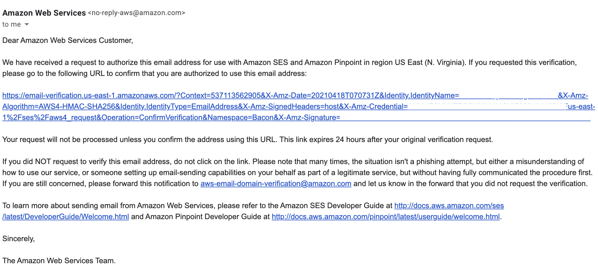
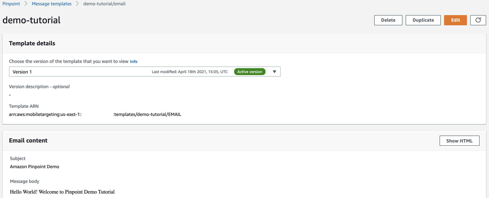

## Amazon Pinpoint

**Introduction**

- Amazon Pinpoint is an AWS service which allow to occupy the customers across multiple messaging channels. We can leverage Amazon Pinpoint to send push notifications, emails, SMS text messages, and voice messages. 

- Amazon Pinpoint allows to send customer oriented messages with better experiences which strengths the association with the customers and reduce the agitate.

- Amazon Pinpoint provides functionalities such as:
    - Marketing campaigns and journeys
    - Transactional messages
    - Analytics tools
    - Generate predictions

- In this tutorial we will focus on first creating a Pinpoint project and then configuring an email and a SMS based notification to send personalized messages

- **Step 1: Create an Amazon Pinpoint project**
  
  - A project in Amazon Pinpoint is a batch of configurations, customer information, segments, and campaigns
  
  - Follow the below steps to deploy project in Amazon Pinpoint
    
    1. Traverse to the <a href="https://console.aws.amazon.com/pinpoint/">Amazon Pinpoint console</a> 

         
           
    2. Enter project name and select Create a project 
     
         
     
    3. Once the project is created, we are ready to add features to the project
     
         

- **Step 2: Configure & Send Email message**
    
    1. On the Configure features page, traverse to Project features > Email/Configure to Set up email.

         
           
    2. Next we will verify an email identity, an identity can be either an email address or a domain. Once the domain is verified, we can send email from any email address on that domain.
     
         
        
        **Verification email**
        
         
     
    3. Return to the Set up email page of the Amazon Pinpoint console. The email address shows as verified
        
        

    4. Once the email address is verified, we are ready to send an email messages.

         
    
    5. Select Test Messaging from the menu bar on the left hand

         
    
    6. Choose the Email channel
    
        
    
    7. Provide recipient email address that we verified for Destination type Email address as the recipient and it can be the same as the sender address, or additional email identities that we have verified
    
        
        
    8.  Choose Create a new message and provide details like Email Subject and Message body
    
        
    
    9. Select the Send message button

        
    
    10. Check the inbox
        
        

- **Step 3: Create a Message Template for SMS**
 
  - Message templates is a method to define consistent messages and reuse content more effectively, even across the projects. We can define message templates for email messages, push notifications, SMS messages, and voice messages.

  - Follow the below steps to define a message template
    
    1. Traverse to the <a href="https://console.aws.amazon.com/pinpoint/">Amazon Pinpoint console</a> then Message templates

         
           
    2. Select Create a template
     
         
     
    3. Select Email for the channel.
     
         
     
    4. Provide name for the new template where as Description is an optional 
     
         
    
    5. Next provide subject and message body
     
        **Email Subject**
          
          
        
        **Message body**

          
     
    6. Select Create to save the message template
      
        

